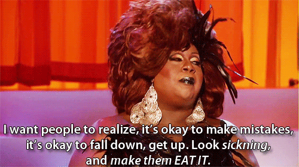
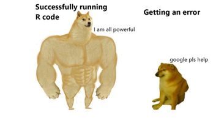

***

### [Course Overview](https://fuzzyatelin.github.io/bioanth-stats/overview.html)
### [Course Outline](https://fuzzyatelin.github.io/bioanth-stats/outline.html)
### [Modules](https://fuzzyatelin.github.io/bioanth-stats/modules.html)
### [Assignments](https://fuzzyatelin.github.io/bioanth-stats/assignments.html)
### [Resources](https://fuzzyatelin.github.io/bioanth-stats/resources.html)
### [Policies](https://fuzzyatelin.github.io/bioanth-stats/policies.html)
### [Insurmountable Coding Problems](https://fuzzyatelin.github.io/bioanth-stats/studentproblems.html)

***

<b>If you don't love your stats, how in the hell you gonna love somebody else(s stats)?</b>
 

   

I struggled in this class a lot and often.  But, I would continue to get on r and use all of my resources (books, the internet, people) to figure it out.  I learned a resilience in coding that I will take with me going forward.  
  

For most of the semester, my two moods were:
 

### What were you asked to do?

***

  + The Modules
  
    + Working through each of the modules.  I do not have these saved.
    
  + HW1: Push it!
  
    + Learning how to do some basic code and then pushing it to Github.
    
    + The repo can be found at [this link!](https://github.com/ZoeEAlbert/AN588-Week-2-Zealbert)
    
  + HW2: Titis in the Mist...
  
    + Probability and primates.
    
    + The repo can be found [here!](https://github.com/ZoeEAlbert/AN588-Week-3-Zealbert-)
  + HW3: Some of my Best Friends are Zombies...
  
    + ggplot, Q-Q plot, random sampling...
    
    + Click [this link](https://github.com/ZoeEAlbert/Zealbert_OriginalHomeworkCode_03) if you want to see the repo!
    
  + HW4: What's Your Malfunction?
  
    + Z prop test, linear regression
    
    + Check it out [here.](https://github.com/ZoeEAlbert/AN588_Malfunction_Zealbert)
    
  + HW5: Boots for Days!
  
    + Bootstrapping.
    
    + [Here she is.](https://github.com/ZoeEAlbert/Boots)
    
  + Peer Commentary
  
    + These can be seen in the repos of my peers.  I always completed them on time, and more often than not met up with the people in my group so that we could trouble shoot and work together. 
    
  + Analysis Replication Assignment
  
    + The thing I am the most proud of.  Attempting to replicate a paper (i.e. the hardest thing I did all semester).
    
    + Find her, in all of her glory, [here.](https://github.com/ZoeEAlbert/zalbert-data-replication-assignment)
    
  + Group Presentation
  
    + Creating a module and presenting it over zoom because I got sick.
    
    + Here is a [link.](https://github.com/vzdanowicz/AN588_ctmm)
  

      

***

### What did you accomplish?

***
In short, I accomplished all of the tasks I was asked to accomplish on time.  

  + The Modules: I stayed on top of the modules, and if I fell behind, I used them in great detail to help with the homework.
    
  + HW1: Push it!: I still remember going to office hours to work on this with you, Miguel and Diego.  We each turned it in on time and compared notes, which was really helpful. I think I accidentally deleted my original push, but you can see it in the commentary. 
    
  + HW2: Titis in the Mist...Turned in on time!  Pretty successful at getting what I needed to. 
  
  + HW3: Some of my Best Friends are Zombies...Difficult and not perfect.  But, done on time.
    
  + HW4: What's Your Malfunction?  Difficult and not perfect.  But, done on time.
    
  + HW5: Boots for Days!  Difficult, but a bit of a reprieve from the two before. Done on time. 
  
  + Peer Commentary.  Done on time.  Worked with my peers, which I think helped us all learn more. 
  
  + Analysis Replication Assignment.  The thing I am most proud of.  Was never able to figure out which factors they used as random effects in the lmm, but I got to work with so many amazing people and really challenge myself.  I still feel as though I was successful. 
  
  + Group Presentation.  We just presented this yesterday, but I am proud of how it turned out.  I started from zero knowledge of ctmm, and now feel as though I could use and explain it to others. 
  
      

***

### How well did you accomplish them?

***

Generally, I think I did a good job of staying on schedule and producing something by the due date, even though it was difficult for me to work and learn that quickly.  I think I accomplished these tasks well because I did a good job of using my resources (professors, peers, books, online resources, friends).  I think the thing I did the least well was grasping why certain stats were used in a good amount of time.  It was really difficult for me to put a test to a study/example without a lot of extra research on the "why".

I would say that there is no easy answer to whether or not my work/understanding/ease improved over the course of the semester because while I certainly got better, I also feel as though there was some degree of "the more that you know, the more you know you don't know".

       

***

### How has your understanding of and approach to statistics and project design changed since taking this course?

***

During my senior year of undergrad (2017), I took a course on animal behavior where I went to the zoo and observed black and white ruffed lemur behavior.  At the end of the semester we did a one hour crash course on r in order to analyze our data, and I was convinced that I had it down, which I now understand was overconfident.  My understanding of statistics has gotten so much deeper over the course of the semester.  I have a better understanding of when and how to use certain statistical tests.  I definitely have a better understanding of what goes into publishing a research paper.  Most importantly, I think I better understand what kind of data I DEFFINITLY need to collect in order to make my analyses easier when I get back from Borneo.  The replication assignment was the most enlightening in that regard.           

***

### What did you learn from all this?

***

  + I learned how to better read a scientific paper to see if their analyses really makes sense or if I am just skimming over it and assuming it makes sense because they are more senior than I am. 
  
  + I learned when its best to go back to your excel sheet and change the columns you made, versus when it is best to do the manipulation on r. 
  
  + I learned that authors don't need to clearly spell out their statistical methodology in order to get a paper published, but that they really really should. 

***

### What did your learn about teamwork in this course? How did the readings on teamwork foster this understanding? How did the teamwork experiences?

***
Reading may be fundamental, but so is teamwork, especially hands on teamwork. I don't know that readings on teamwork were especially useful, but the teamwork experiences were.  I am happy to have had the chance to work with many different people in the class for two main reasons.  First, everyone had different skill sets that they could share and secondly, it pushed me to work on my scientific collaboration. 

Additionally, I would say that I went "above and beyond" in the teamwork category of this course by spending a great deal of time working with colleagues from around the country in order to better my stats skills.  On this list (of individuals who are not students in this class) are: [Mel Zarate](https://www.bu.edu/anthrop/profile/melissa-zarate/), [Faye Harwell](https://www.bu.edu/anthrop/profile/faye-harwell/), [Laura Brubaker-Wittman](https://www.bu.edu/anthrop/profile/laura-brubaker-wittman/), [Margaret Buhler](https://liberalarts.tulane.edu/departments/anthropology/people/graduate-students/margaret-buehler), [Rebecca Levy](https://sites.google.com/view/rpi-imd-ledet-home/people), [Natalie Pilgeram](http://psychology.emory.edu/home/people/students.html), [Agatha Downey](https://linguistics.washington.edu/people/cm-downey) and [Aryeh Miller](https://aryehmiller.com/).
            

***

### How did the Peer Commentary process and Group Project relate, if at all, to what you view as your successes or difficulties in this course?

***

How did I accomplish my goals this semester? [With A Little Help From My Friends!](https://www.youtube.com/watch?v=0C58ttB2-Qg)

I am so very glad that this course was based on the premise of working with different group members because I feel as though it is so easy to get in your own head, and be unable to see different solutions when working in r.  My group mates contributed a great deal to my success.

I found the group project to be more difficult than the homework assignments because I did not know anything about our topic.  I had to teach myself the basic biology and read a lot of literature before I could be of any help. 

            

***

### What, if anything, of lasting value do you take away from this experience? If nothing, what would you do differently if you were to start over in this course? 

***

The most important thing that I learned/ was reminded of is the fact that there will always be someone in the room that I perceive as smarter/more talented than me...and that that is a wonderful thing!  It is so awesome to have colleagues who can help you, and who you can help in return.  Science doesn't need to be a competition.  It should be a collaboration between curious people seeking answers in order to make the world better.  Learning to acknowledge your blind spots, ask for help, and work together is an incredibly powerful thing.  We all think differently when answering questions, and have our own strengths, both of which are beneficial to scientific collaboration. 
            

***

### Taking this self-assessment into account (and with **A** being the highest), if you were the instructor, what grade would you give yourself given your evaluation of your own performance this semester? Please be honest.

***
I would like to note that I struggled with this question for about a month.  First, came the feeling that I was a failure and my grade should reflect how hard I had to work to produce anything in the course (even the easy stuff).  Next, came the feeling of complacency: Should I settle for a B?  Then, I talked to Laura Brubaker-Wittman. She said "for how hard you have been working all semester you better give yourself an A".  I don't know that I deserve an A, but I have worked my tail off and improved DRAMATICALLY since day one.  In the spirit of women, and female people, asking for what they deserve, I think I have earned an A-. 

 
[A-]
 

***